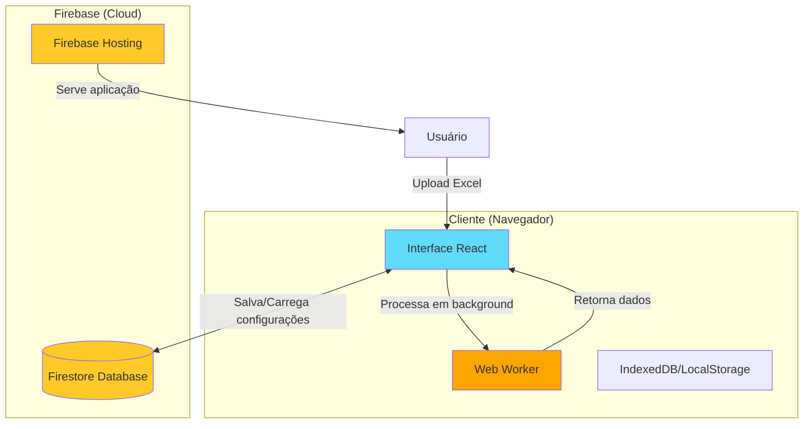
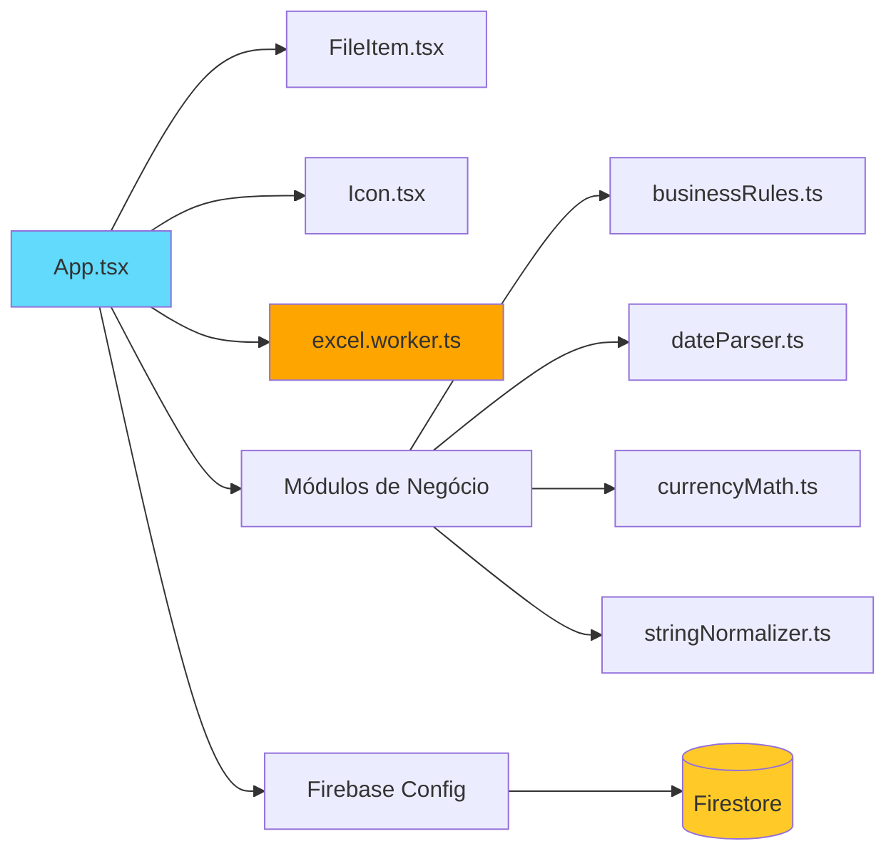
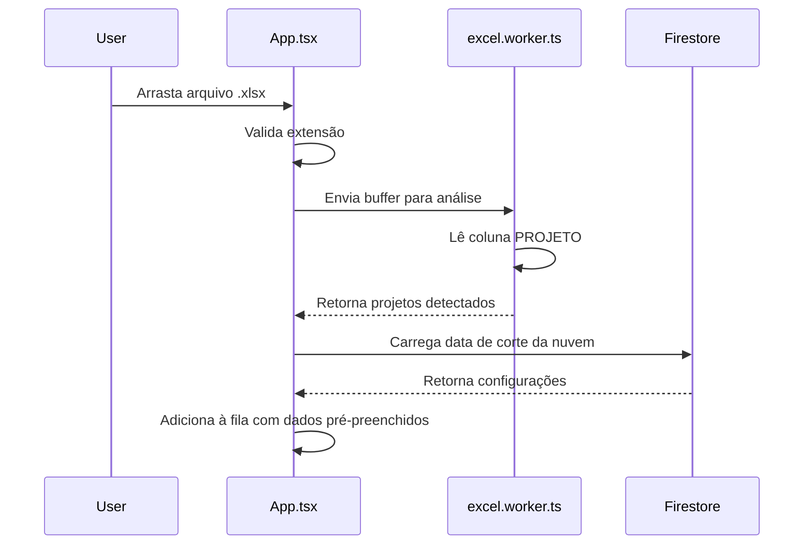
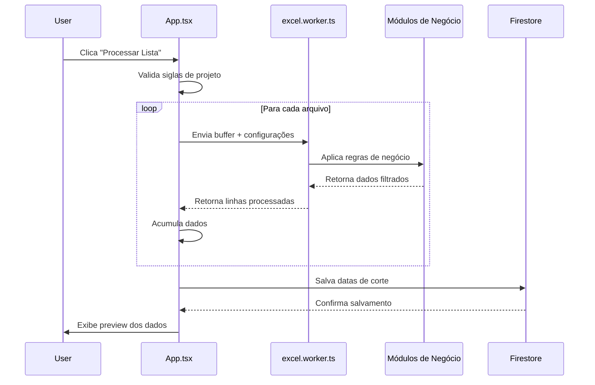
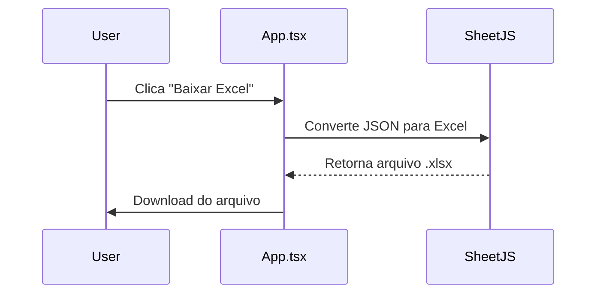

# Arquitetura do Hube Power BI Manager

Este documento descreve a arquitetura técnica do projeto, decisões de design e fluxo de dados.

---

## 📐 Visão Geral

O **Hube Power BI Manager** é uma **aplicação web frontend** (SPA - Single Page Application) que processa planilhas Excel localmente no navegador do usuário, sem necessidade de backend para processamento de dados.



---

## 🏗️ Arquitetura de Componentes

### Frontend (React + TypeScript)



### Estrutura de Diretórios

```
hube-powerbi-manager/
├── src/
│   ├── components/              # Componentes React
│   │   ├── FileItem.tsx         # Item da fila (exibe arquivo + inputs)
│   │   └── Icon.tsx             # Wrapper para ícones Lucide
│   │
│   ├── config/                  # Configurações
│   │   ├── constants.ts         # Constantes (projetos, mapeamentos)
│   │   └── firebase.ts          # Configuração Firebase
│   │
│   ├── modules/                 # Lógica de negócio (pura)
│   │   ├── businessRules.ts     # Regras de filtro e risco
│   │   ├── currencyMath.ts      # Parsing de moeda e cálculos
│   │   ├── dateParser.ts        # Parsing e formatação de datas
│   │   └── stringNormalizer.ts  # Normalização de strings
│   │
│   ├── workers/                 # Web Workers
│   │   └── excel.worker.ts      # Processamento Excel em background
│   │
│   ├── types/                   # TypeScript types
│   │   └── index.ts             # Interfaces e tipos
│   │
│   ├── App.tsx                  # Componente principal
│   ├── main.tsx                 # Entry point
│   └── index.css                # Estilos globais (Tailwind)
│
├── .github/
│   └── workflows/
│       └── firebase-hosting-merge.yml  # CI/CD automático
│
├── docs/                        # Documentação
│   └── ARCHITECTURE.md          # Este arquivo
│
├── firebase.json                # Configuração Firebase Hosting
├── package.json
├── tsconfig.json
├── vite.config.js
└── README.md
```

---

## 🔄 Fluxo de Dados

### 1. Upload de Arquivos



### 2. Processamento



### 3. Exportação



---

## 🧩 Componentes Principais

### `App.tsx` (Componente Principal)

**Responsabilidades:**

- Gerenciar estado global (fila de arquivos, dados processados)
- Orquestrar comunicação com Web Workers
- Integração com Firebase (salvar/carregar configurações)
- Renderizar UI e coordenar componentes

**Estados principais:**

```typescript
const [fileQueue, setFileQueue] = useState<FileQueueItem[]>([]);
const [processedData, setProcessedData] = useState<ProcessedRow[]>([]);
const [isProcessing, setIsProcessing] = useState<boolean>(false);
const [cloudCutoffs, setCloudCutoffs] = useState<Record<string, string>>(DEFAULT_CUTOFFS);
```

---

### `excel.worker.ts` (Web Worker)

**Por que Web Worker?**

- Processa arquivos Excel **sem travar a UI**
- Permite processamento paralelo de múltiplos arquivos
- Melhora significativamente a experiência do usuário

**Ações:**

1. **`analyze`**: Detecta projetos na planilha (lê coluna `PROJETO`)
2. **`process`**: Processa planilha completa (filtra, normaliza, calcula)

**Fluxo interno:**

```typescript
// 1. Recebe mensagem
onmessage = (e) => {
  const { action, fileBuffer, manualCode, cutoffDate } = e.data;
  
  // 2. Lê Excel
  const workbook = XLSX.read(fileBuffer);
  
  // 3. Aplica lógica de negócio
  const rows = processSheet(workbook, manualCode, cutoffDate);
  
  // 4. Retorna resultado
  postMessage({ success: true, rows });
};
```

---

### Módulos de Negócio

#### `businessRules.ts`

- **Filtros**: Remove linhas canceladas, sem identificação, fora da data de corte
- **Cálculo de Risco**: Baseado em status e dias de atraso
- **Validações**: Verifica se linha é válida para processamento

```typescript
export function shouldIncludeRow(row: any, cutoffDate: Date): boolean {
  // Ignora cancelados
  if (isStatusCancelled(row.status)) return false;
  
  // Ignora sem identificação
  if (!row.instalacao && !row.cnpj) return false;
  
  // Ignora fora da data de corte
  if (row.referencia < cutoffDate) return false;
  
  return true;
}
```

#### `dateParser.ts`

- **Parsing**: Converte strings em datas (múltiplos formatos)
- **Formatação**: Padroniza para `DD/MM/AAAA`
- **Cálculos**: Dias de atraso, diferenças

```typescript
export function parseDate(value: any): Date | null {
  // Suporta: "01/2025", "15/01/2025", números Excel, etc.
}
```

#### `currencyMath.ts`

- **Parsing**: Remove símbolos (`R$`, `.`, `,`) e converte para número
- **Cálculos**: Economia, percentuais
- **Formatação**: Retorna strings formatadas

```typescript
export function parseCurrency(value: any): number {
  // "R$ 1.500,00" → 1500.00
}
```

#### `stringNormalizer.ts`

- **Instalações**: Remove caracteres especiais (`10/530195-7` → `105301957`)
- **Distribuidoras**: Maiúsculas, sem underscores (`energisa_mt` → `ENERGISA MT`)
- **Status**: Transformações (`Acordo` → `Negociado`)

---

## ☁️ Firebase (Backend as a Service)

### Firestore Database

**Estrutura de dados:**

```
app_settings/
└── cutoffs/
    ├── LNV: "2025-01-01"
    ├── ALA: "2025-01-01"
    ├── ESP: "2025-05-01"
    ├── EMG: "2025-05-01"
    ├── EGS: "2025-06-01"
    └── MTX: "2025-01-01"
```

**Por que Firestore?**

- ✅ **Memória coletiva**: Datas de corte compartilhadas entre usuários
- ✅ **Sincronização automática**: Mudanças refletem em tempo real
- ✅ **Sem backend**: Não precisa criar API própria
- ✅ **Offline-first**: Funciona sem internet (com cache)

**Regras de segurança:**

```javascript
rules_version = '2';
service cloud.firestore {
  match /databases/{database}/documents {
    match /app_settings/{document=**} {
      allow read, write: if true;  // ⚠️ Público (OK para este caso)
    }
  }
}
```

> **Nota**: Para produção com dados sensíveis, implemente autenticação Firebase.

### Firebase Hosting

- **Deploy automático**: Via GitHub Actions (push para `master`)
- **CDN global**: Baixa latência
- **HTTPS gratuito**: Certificado SSL automático
- **Rewrites**: SPA routing (`/** → /index.html`)

---

## 🛠️ Stack Tecnológica

### Frontend

| Tecnologia | Versão | Uso |
|-----------|--------|-----|
| **React** | 18.2 | Biblioteca UI |
| **TypeScript** | 5.9 | Type safety |
| **Vite** | 4.4 | Build tool (HMR, bundling) |
| **Tailwind CSS** | 3.3 | Styling (utility-first) |
| **Lucide React** | 0.263 | Ícones modernos |

### Processamento

| Tecnologia | Uso |
|-----------|-----|
| **SheetJS (xlsx)** | Leitura/escrita de Excel |
| **Web Workers** | Processamento paralelo sem travar UI |

### Backend/Cloud

| Tecnologia | Uso |
|-----------|-----|
| **Firebase Firestore** | Banco de dados NoSQL (configurações) |
| **Firebase Hosting** | Hospedagem estática (CDN) |

### DevOps

| Tecnologia | Uso |
|-----------|-----|
| **GitHub Actions** | CI/CD automático |
| **ESLint** | Linting (qualidade de código) |
| **PostCSS** | Processamento CSS (Tailwind) |

---

## 🎨 Decisões de Design

### Por que SPA (Single Page Application)?

- ✅ **Processamento local**: Dados sensíveis não saem do navegador
- ✅ **Sem custos de servidor**: Apenas Firebase (free tier suficiente)
- ✅ **Offline-capable**: Pode funcionar sem internet (após primeiro carregamento)
- ✅ **Performance**: Sem latência de rede para processamento

### Por que Web Workers?

- ✅ **UI responsiva**: Processamento pesado não trava a interface
- ✅ **Melhor UX**: Usuário pode interagir durante processamento
- ✅ **Paralelização**: Múltiplos arquivos processados simultaneamente

### Por que Tailwind CSS?

- ✅ **Produtividade**: Classes utilitárias aceleram desenvolvimento
- ✅ **Consistência**: Design system embutido
- ✅ **Tree-shaking**: CSS final otimizado (apenas classes usadas)
- ✅ **Responsivo**: Mobile-first por padrão

### Por que Firebase?

- ✅ **Sem backend**: Não precisa criar/manter servidor
- ✅ **Escalável**: Suporta crescimento sem mudanças
- ✅ **Tempo real**: Sincronização automática entre usuários
- ✅ **Gratuito**: Free tier generoso

---

## 🔐 Segurança e Privacidade

### Dados Sensíveis

- ✅ **Processamento local**: Planilhas Excel **nunca** são enviadas para servidor
- ✅ **Apenas configurações na nuvem**: Somente datas de corte são salvas no Firebase
- ✅ **Sem autenticação**: Dados não são associados a usuários específicos

### Limitações Atuais

- ⚠️ **Firestore público**: Qualquer pessoa pode ler/escrever datas de corte
- ⚠️ **Sem auditoria**: Não há log de quem alterou configurações

### Melhorias Futuras

Para ambientes de produção com dados críticos:

1. **Implementar Firebase Authentication**
2. **Regras de segurança baseadas em usuário**
3. **Auditoria de alterações** (Cloud Functions)
4. **Criptografia de dados** (se necessário)

---

## 📊 Performance

### Métricas

- ⚡ **Detecção de projeto**: < 100ms por arquivo
- ⚡ **Processamento**: ~1000 linhas/segundo (depende do hardware)
- ⚡ **Build size**: ~500KB (gzipped)
- ⚡ **First Contentful Paint**: < 1s (em rede rápida)

### Otimizações

1. **Web Workers**: Processamento em background
2. **Code splitting**: Vite carrega apenas código necessário
3. **Tree shaking**: Remove código não utilizado
4. **Lazy loading**: Componentes carregados sob demanda
5. **Memoization**: `useMemo` e `useCallback` para evitar re-renders

---

## 🚀 Deploy e CI/CD

### GitHub Actions Workflow

```yaml
name: Deploy to Firebase Hosting on merge
on:
  push:
    branches: [master]

jobs:
  build_and_deploy:
    runs-on: ubuntu-latest
    steps:
      - uses: actions/checkout@v3
      - run: npm ci && npm run build
      - uses: FirebaseExtended/action-hosting-deploy@v0
        with:
          repoToken: '${{ secrets.GITHUB_TOKEN }}'
          firebaseServiceAccount: '${{ secrets.FIREBASE_SERVICE_ACCOUNT }}'
          channelId: live
          projectId: hube-powerbi-manager
```

**Fluxo:**

1. Push para `master`
2. GitHub Actions executa build
3. Deploy automático para Firebase Hosting
4. Aplicação disponível em produção

---

## 🔮 Roadmap Técnico

### Curto Prazo

- [ ] Adicionar testes unitários (Vitest)
- [ ] Implementar error boundaries
- [ ] Melhorar tratamento de erros
- [ ] Adicionar loading skeletons

### Médio Prazo

- [ ] Suporte a mais formatos (ODS, Google Sheets)
- [ ] Exportação para outros formatos (CSV, JSON)
- [ ] Histórico de processamentos
- [ ] Comparação entre versões

### Longo Prazo

- [ ] Autenticação Firebase
- [ ] Dashboards de visualização
- [ ] API para integração com Power BI
- [ ] Modo colaborativo (múltiplos usuários)

---

## 📚 Referências

- [React Documentation](https://react.dev/)
- [TypeScript Handbook](https://www.typescriptlang.org/docs/)
- [Vite Guide](https://vitejs.dev/guide/)
- [Tailwind CSS](https://tailwindcss.com/docs)
- [Firebase Documentation](https://firebase.google.com/docs)
- [SheetJS Documentation](https://docs.sheetjs.com/)
- [Web Workers API](https://developer.mozilla.org/en-US/docs/Web/API/Web_Workers_API)

---

**Última atualização**: Dezembro 2025
